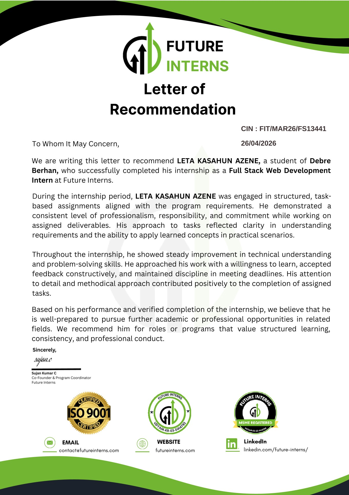

# Leta Kasahun — Portfolio Web Application

A modern, responsive portfolio web application designed to showcase software engineering projects, deep-dive case studies, interactive system architecture flows, and technical competencies.

---

## Sections Overview

### 1. Hero Section
- High-impact introduction with profile details and quick action links (View Projects, Contact, View Resume).
- Direct access to external profiles (GitHub, LinkedIn, Telegram, Email).
- Fast, clean visual presentation with optimized assets.

### 2. Projects & Case Studies
- Featured project gallery with live demo previews and repository links.
- Structured technical case studies highlighting the engineering objective, implementation steps, and measurable results.
- Key deliverables presented with terminal-styled bullet points (`>`).

### 3. Interactive System Architecture
- Visual system architecture diagrams embedded directly within project case studies.
- Interactive nodes that visitors can click to inspect component roles, communication protocols, and technical specifications.

### 4. Technical Skills Matrix
- Structured overview of technical abilities grouped by category (Frontend, Backend, Databases, Cloud & DevOps, Core Concepts).
- Clear representation of technical proficiency and tools used across projects.

### 5. Experience & Education
- Career history outlining engineering roles, team contributions, and key deliverables.
- Academic background in Software Engineering with milestones.

### 6. Certificates & Resume with PDF Viewers
- Built-in PDF reader modals for verified certificates and resume documents.
- Allows visitors to inspect credentials and download files directly in the browser without leaving the page.

### 7. Live GitHub Activity
- Real-time GitHub integration showcasing public commit activity and repository contributions.

### 8. Command Palette Search
- Fast command center accessible via `⌘K` or `Ctrl+K` on desktop and touch controls on mobile.
- Allows instant search and navigation across all pages, projects, and actions.

### 9. Contact Section
- Integrated contact form and direct communication channels for project discussions and inquiries.

---

## Core Characteristics

- **Built with Next.js**: Utilizes modern App Router and server rendering for clean structure and fast execution.
- **Fully Responsive**: Carefully tuned layout for smartphones, tablets, and wide monitors.
- **Fast Performance & Lazy Loading**: Smooth scrolling and on-demand asset loading for an instant user experience.
- **Modern Styling**: Tailwind CSS with custom terminal aesthetic, subtle borders, and glassmorphic elements.
- **Database Backed**: PostgreSQL managed through Prisma for project and content management.

---

